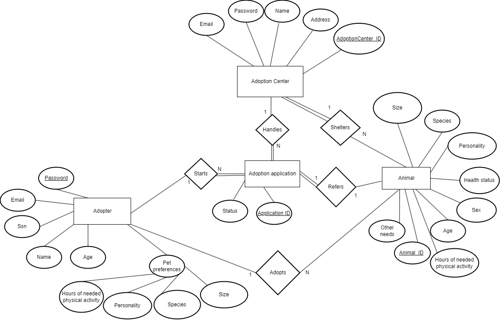

# Backend and Frontend Template

Latest version: https://git.ita.chalmers.se/courses/dit341/group-00-web (public Github [mirror](https://github.com/dit341/group-00-web))

## Project Structure

| File        | Purpose           | What you do?  |
| ------------- | ------------- | ----- |
| `server/` | Backend server code | All your server code |
| [server/README.md](server/README.md) | Everything about the server | **READ ME** carefully! |
| `client/` | Frontend client code | All your client code |
| [client/README.md](client/README.md) | Everything about the client | **READ ME** carefully! |
| [docs/DEPLOYMENT.md](docs/DEPLOYMENT.md) | Free online production deployment | Deploy your app online in production mode |
| [docs/LOCAL_DEPLOYMENT.md](docs/LOCAL_DEPLOYMENT.md) | Local production deployment | Deploy your app local in production mode |

## Requirements

The version numbers in brackets indicate the tested versions but feel free to use more recent versions.
You can also use alternative tools if you know how to configure them (e.g., Firefox instead of Chrome).

* [Git](https://git-scm.com/) (v2) => [installation instructions](https://www.atlassian.com/git/tutorials/install-git)
  * [Add your Git username and set your email](https://docs.gitlab.com/ce/gitlab-basics/start-using-git.html#add-your-git-username-and-set-your-email)
    * `git config --global user.name "YOUR_USERNAME"` => check `git config --global user.name`
    * `git config --global user.email "email@example.com"` => check `git config --global user.email`
  * > **Windows users**: We recommend to use the [Git Bash](https://www.atlassian.com/git/tutorials/git-bash) shell from your Git installation or the Bash shell from the [Windows Subsystem for Linux](https://docs.microsoft.com/en-us/windows/wsl/install-win10) to run all shell commands for this project.
* [Chalmers GitLab](https://git.ita.chalmers.se/) => Login with your **Chalmers CID** choosing "Sign in with" **Chalmers Login**. (contact [support@chalmers.se](mailto:support@chalmers.se) if you don't have one)
  * DIT341 course group: https://git.ita.chalmers.se/courses/dit341
  * [Setup SSH key with Gitlab](https://docs.gitlab.com/ee/ssh/)
    * Create an SSH key pair `ssh-keygen -t ed25519 -C "email@example.com"` (skip if you already have one)
    * Add your public SSH key to your Gitlab profile under https://git.ita.chalmers.se/profile/keys
    * Make sure the email you use to commit is registered under https://git.ita.chalmers.se/profile/emails
  * Checkout the [Backend-Frontend](https://git.ita.chalmers.se/courses/dit341/group-00-web) template `git clone git@git.ita.chalmers.se:courses/dit341/group-00-web.git`
* [Server Requirements](./server/README.md#Requirements)
* [Client Requirements](./client/README.md#Requirements)

## Getting started

```bash
# Clone repository
git clone git@git.ita.chalmers.se:courses/dit341/group-00-web.git

# Change into the directory
cd group-00-web

# Setup backend
cd server && npm install
npm run dev

# Setup frontend
cd client && npm install
npm run serve
```

> Check out the detailed instructions for [backend](./server/README.md) and [frontend](./client/README.md).

## Visual Studio Code (VSCode)

Open the `server` and `client` in separate VSCode workspaces or open the combined [backend-frontend.code-workspace](./backend-frontend.code-workspace). Otherwise, workspace-specific settings don't work properly.

## System Definition (MS0)

### Purpose

The purpose of this system is to facilitate the process of pet adoption. It serves as a platform that gets together people that are interested in becoming pet owners as well as several adoption centers. By asking questions about their lifestyle, the app can determine which pets that are up for adoption can be suitable for them and thus increase the chances of successful adoptions. Because it gathers several adoption centers in one place, it also makes the process of adoption more accessible, and users are no longer required to browse through websites of several organizations and make different profiles or applications for each. 

### Pages

* **Register Page:** 
  
  A new potential adopter registers on this page to create an account. He/she fills in necessary profile information such as 
  - social security number (SSN)
  - name
  - age
  - gender
  - personality
  - pet preferences

* **Log In Page:**

   Registered potential adopter uses this page to log in. He/she fills in the username and password.

* **Adopter Home Page:**

   The first screen that the user sees when going to the site or logging in. From here you can navigate to show matches page, account page and more.   

* **Show Matches Page:**

   Shows a scroll-view with results of the matching animals for the potential adopter. Information about the animal is also displayed.  

* **Manage Account Page:**

   Change profile information such as password, username, pet preferences etc.

* **Adoption Center Register Page:**

   A new potential adoption center registers on this page to create an account. They fill in their username and password as well as additional information.

* **Adoption Center Home Page:**

   Display options such as manage application, register pet, manage pets, active applications.

* **Adoption Center Contracts Page:**

   Display signed and yet to be signed contracts.

* **Adoption Center Register Pet Page:**

   Display a form which will register the pet’s information

* **Adoption Center Manage Pets Page:**

   Display all pets registered by this adoption center and enable editing their information.


  


### Entity-Relationship (ER) Diagram

 

## Teaser (MS3)

**...**
